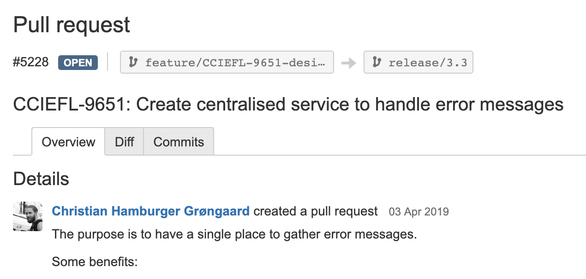

# Designing for Error

---

2nd slide

---

Idea

---



---

**Railway Oriented Programming** — error handling in functional languages

by Scott Wlaschin

(2014)

🎥 https://vimeo.com/97344498

---

**Functional Geekery**

with David Chambers

(2015)

🎧 https://www.functionalgeekery.com/episode-31-david-chambers/

---

!FP 😰

---

Different way of structuring code

---

Mindset

---

Making it harder to choose the happy path

---

⚠️ Our code is fine

---

👍 Small improvements

---

```js
getSomething().then(something => {
  // do something
});
```

---

```js
getSomething().then(
  something => {
    // do something
  },
  error => {
    // deal with the error
  },
);
```

---

Let's talk about Promises another time

---

```typescript
import { DialogService } from '...';
import { GettextCatalog } from '...';

// ...

constructor(
  @Inject('gettextCatalog') private gettextCatalog: GettextCatalog,
  private dialogService: DialogService,
) {}

// ...

getSomething(...)
  .then(...)
  .catch(() => {
    this.dialogService.showErrorDialog(this.gettextCatalog.getString('My error message'));
  });
```

---

```typescript
getSomething(...)
  .then(...)
  .catch(() => {
    this.dialogService.showErrorDialog('My error message');
  });
```

---

```typescript
getSomething(...)
  .then(...)
  .catch(error => {
    this.dialogService.showErrorDialog(error);
  });
```

---

```typescript
getSomething(...)
  .then(...)
  .catch(() => {
    this.dialogService.showError(CueError.SomeError);
  });
```

---

```typescript
getSomething(...)
  .then(...)
  .catch(error => {
    this.dialogService.showErrorWithLog(CueError.SomeError, error);
  });
```

---

```typescript
export enum CueError {
  SomeError,
  SomeOtherError,
  YetAnotherError,
  ...
}
```

---

```typescript
export enum CueError {
  DropError,
  WorkflowErrorRequiredField,
  WorkflowErrorInsufficientRights,
  WorkflowErrorForeignLock,
}
```

---

😕

---

📖 Let's read the commit

---

```
CCIEFL-9651: Create centralised service to handle error messages

The purpose is to have a single place to gather error messages.
```

---

```typescript
// DialogService

public showError(error: CueError): Promise<void> {
  return this.showErrorDialog(
    this.errorMessagesService.getErrorMessage(error)
  );
}

public showErrorWithLog(error: CueError, log: string): Promise<void> {
  console.error(log);
  return this.showError(error);
}
```

---

Benefits?

---

```
Some benefits:

- Errors are no longer magic strings.
- It makes it easier to standardise our error messages and make them consistent.
- It makes it easier to see where each error can occur.
- It allows you to produce a translatable error state outside of the
  Angular(JS) context (since a free function could return
  `SomeData | CueError.SomeError`.)
- We get better at thinking about errors up-front (since they can be defined
  up-front.)
- It allows you to not worry about making typos (since you don't have to type
  out error messages that often.)
- It allows you to not worry about duplicating an error message.
- It helps you remember to make the error message translatable.
```

---

```
Some downsides:

- It can be hard to come up with a good name for an error (to use in the
  `CueError` enum.)
- I haven't found a nice way to pass "extra data" to show an interpolated error
  message.
```

---

```typescript
const message = this.gettextCatalog.getString(
  'Could not delete a page called {{pageName}}.',
  { pageName: this.sectionPageLink.name },
);

this.dialogService.showErrorDialog(message);
```

---

🙇‍️
